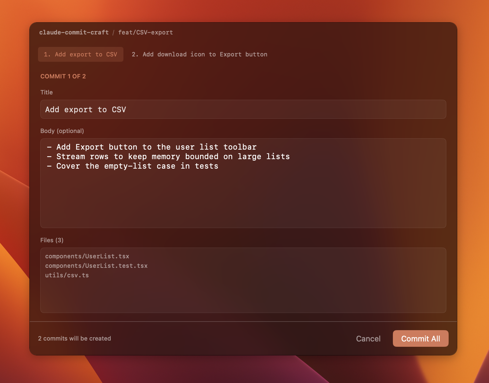

# claude-commit-craft

Claude Code skill that opens a native macOS dialog when you ask Claude to commit. Splits pending changes into single-concern commits, drafts titles and bodies, and shows them for review before anything hits git.



## Install

macOS 13+, Swift 6, Claude Code.

```sh
git clone https://github.com/<you>/claude-commit-craft.git
cd claude-commit-craft
make install
```

Ask Claude to commit your changes or run `/commit-craft`.

Uninstall: `make uninstall`. See `make help` for the other targets.

## Layout

```
.
├── skill/                  the markdown skill source
│   ├── _parts/
│   │   ├── manifest.txt    build order
│   │   ├── workflow/       phase-by-phase orchestration
│   │   ├── commits/        title / body / grouping / safety rules
│   │   └── interfaces/     dialog + fallback contracts
│   ├── build/              generated SKILL.md, gitignored
│   └── build.sh            composes _parts/ into build/SKILL.md
└── dialog/                 SwiftUI app
```

Install assembles both into `~/.claude/skills/commit-craft/`.

## Tweaking

Edit files in `skill/_parts/commits/`, then `make install`. The manifest decides the order things appear in the generated `skill/build/SKILL.md`.


## License

MIT.
